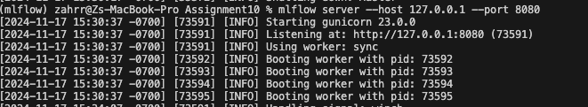
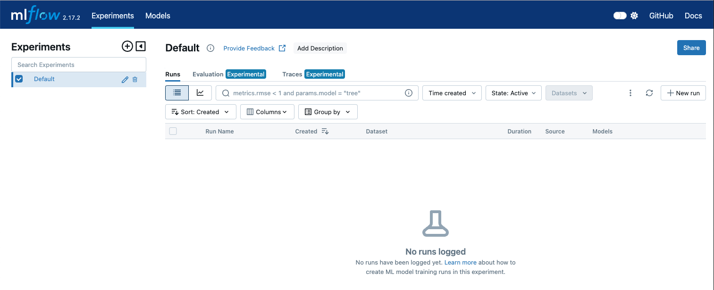
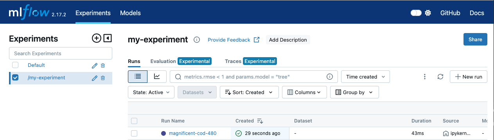
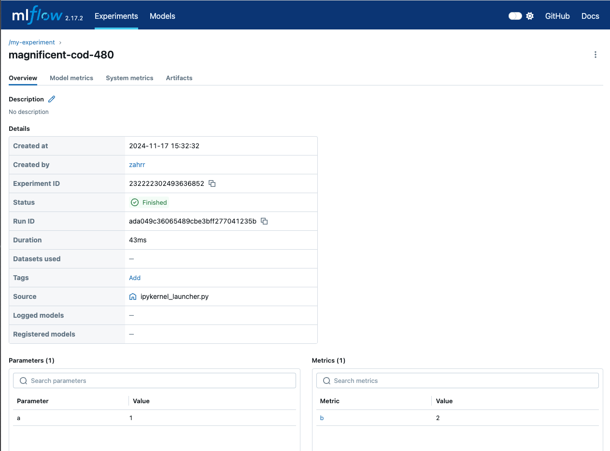
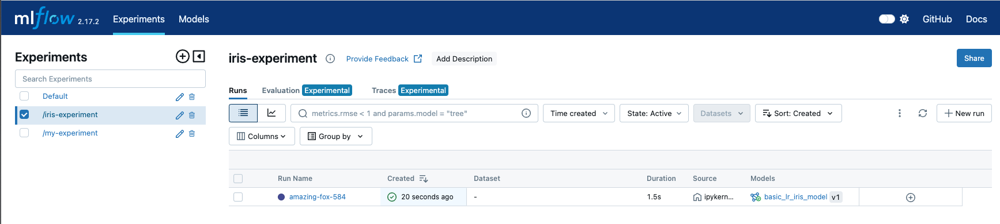
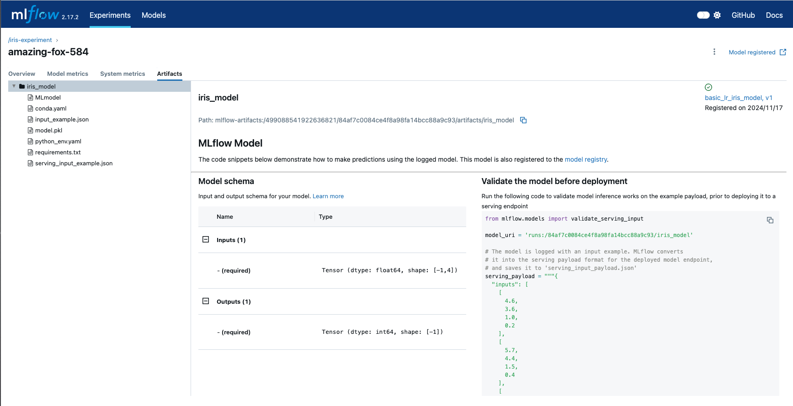
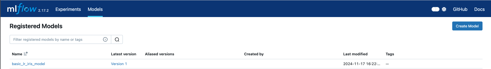
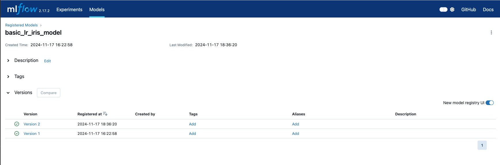

# Part 1: Deploy MLFlow Locally

# What is MLFlow?

MLflow combines functionality and UI to make it easier for data science teams to organize, track, evaluate, and promote their machine learning models through development, testing, and production. 

MLflow has key components that help data science teams with these tasks:

- Tracking Server:
    - provides both an API and a UI to help log parameters and metrics, code versions, and artifacts during the development process.
- Model Registry
    - assists in handling different versions of models, understanding which model is in which state (e.g., dev, test, prod), and ensuring productionization follows best practices. The model registry offers centralized storage, APIs, and UIs to collaboratively manage an MLflow model’s lifecycle.
- Projects
    - Projects standardize the packaging of ML code, workflows, and artifacts, akin to an executable. A project can be a directory with code or a Git repository, and employs a descriptor or convention to define dependencies and execution method.

New features in MLflow are dedicated to LLMOps:

- MLflow deployments for LLMs
    - A server with standardized APIs that helps streamline access to both SaaS and OSS LLMs. It allows for authenticated access and offers a common set of APIs for prominent LLMs.
- Prompt Engineering UI
    - A dedicated, UI-centric environment for prompt engineering, providing a space for prompt experimentation, refinement, evaluation, testing, and deployment.

The key benefits of using MLflow are:

- Experiment management, reproducibility, deployment consistency, model management, and library agnosticism.
- Runs can operate on distributed clusters (i.e., through integration with Spark), parallel runs for hyperparameter tuning, interoperability with distributed storage (e.g., Azure Blob Storage, S3, Spaces), and centralized model management with model registry

# Options for Using MLFlow

There are two primary ways to use MLflow: either as a self-managed service or through a managed service provided by Databricks. In this tutorial, we will provision (i.e., self-manage) our own infrastructure for MLflow, and deploying it on DigitalOcean infrastructure. 

**Pros of Self-Managed**

- Full control of your data and model
- No subscription required
- Unlimited quota of experiments and runs
- Customize your UI by forking the MLflow repo and modify the UI code

**Cons of Self-Managed**

- Requires manual setup and maintenance
- Not suitable for cloud-based notebooks (e.g., Google Colab)
- Requires extra port forwarding if you deploy your server on cloud VM
- No serving support

In the first part of the assignment, we’ll get used to MLflow by running it on our local machines. This consists of two parts: first, we will start the MLflow server locally, and then we’ll connect an MLflow session to our MLflow server IP by using the MLflow API. We’ll explain key concepts of MLflow as we move through the assignment.

**Step 0 (Optional): Set up a New Python Environment for MLFlow**

Let’s create a new virtual environment for our MLFlow deployment. Navigate to (or create) a directory where you want this project to live. Open a terminal and run the following command to create a new virtualenv: 

```bash
pyenv virtualenv 3.12.1 mflow
```

Activate your environment:

```bash
pyenv activate mlflow
```

# Step 1: Start a Local MLFlow Server

1. Install MLFlow by running the following command in a terminal session:

```python
pip install mlflow
```

2. Start the local MLFlow server using the MLFlow CLI by running:

```python
mlflow server --host 127.0.0.1 --port 8080
```

The terminal output will include the address of the MLFLow tracking server:



Copy the URL of the MLFlow tracking server (http://127.0.0.1:8080) and paste it into the address bar in your browser. This will bring you to the MLFlow UI:



We’ll address key parts of the MLflow UI throughout the assignment. The key parts of the tracking server UI that we’ll become familiar with are Experiments, Runs, Evaluations, and Models.

# Step 2: Connect an MLFlow Session to Your Server

Now that the MLFlow tracking server is running we can connect to the server in order to record experiments in the tracking server. 

We’ll work in the context of a Jupyter notebook for the next part. You can also use a `.py` file if you choose; since notebooks are how most data scientists will use MLFlow, we’ll be working with notebooks for the following example. 

**Create a notebook in the Jupyter Lab UI:**

Open a new terminal in the assignment directory, activate your `mlflow` environment in the new terminal by running `pyenv activate mlflow` . Run  `jupyter lab` to launch the Jupyter Lab UI. 

**Alternatively, create a notebook in VSCode:**

You can also choose to create a new file directly in the VSCode UI called `assignment10.ipynb` . In the explorer left-hand sidebar, right click, select **create file** and then create a file called `assignment10.ipynb` 

Add the following import statement:

```python
import mlflow
```

We’ll tell mlflow where to access our tracking server by adding the following to a cell and then running it:

```python
mlflow.set_tracking_uri("http://localhost:5000")
```

Next, we’ll set an experiment name:

```python
mlflow.set_experiment("/my-experiment")
```

Now, let’s log some arbitrary parameters and metrics:

```python
with mlflow.start_run():
	mlflow.log_parameter("foo", 1)
	mlflow.log_metric("bar", 2)
```

**Optional:** 

If you choose to use a python file instead of a jupyter notebook, you can add the following to a new file called `*log_mlflow_with_localhost.py*`

```python
import mlflow

mlflow.set_tracking_uri("http://localhost:5000")
mlflow.set_experiment("check-localhost-connection")

with mlflow.start_run():
	mlflow.log_metric("foo":1)
	mlflow.log_metric("bar":2)
```

Then execute it by running the following in your terminal:

```python
python log_mlflow_with_localhost.py
```

`mlflow.set_experiment`  and `mlflow.start_run` calls make API requests to your tracking server. Navigate back to your tracking server UI (in your browser, navigate to `http:127.0.0.1:8080`). You’ll see that your experiment has been added to the list of experiments:



Click on the **Run Name** listed (e.g., click on `magnificent-cod-480`; your run name will be different.). On the bottom of the screen, you’ll see the Parameters and Metrics that you logged:



Now that we’ve established the basics of tracking our experiments, let’s try working through a more complete example:

Let’s modify our notebook with the following import statements:

```python
import pandas as pd
from sklearn import datasets
from sklearn.linear_model import LogisticRegression
from sklearn.metrics import accuracy_score
from sklearn.model_selection import train_test_split

import mlflow
from mlflow.models import infer_signature
```

We’ll use the classic Iris dataset for this example. We’ll load the dataset, split into test and training sets, define our model’s parameters, train, predict, and calculate accuracy as a target loss metric:

```python
# Load the Iris dataset
X, y = datasets.load_iris(return_X_y=True)

# Split the data into training and test sets
X_train, X_test, y_train, y_test = train_test_split(X, y, test_size=0.2, random_state=42)

# Define the model hyperparameters
params = {"solver": "lbfgs", "max_iter": 1000, "multi_class": "auto", "random_state": 8888}

# Train the model
lr = LogisticRegression(**params)
lr.fit(X_train, y_train)

# Predict on the test set
y_pred = lr.predict(X_test)

# Calculate accuracy as a target loss metric
accuracy = accuracy_score(y_test, y_pred)
```

Now, let’s set a new MLflow experiment: 

```python
mlflow.set_experiment("/iris-experiment")
```

Next, we’ll start an MLflow run. We’ll start the run, log our parameters, the loss metric, add a tag, set the model signature, and then log the model’s information: 

```python
# Start an MLflow run
with mlflow.start_run():
    # Log the hyperparameters
    mlflow.log_params(params)

    # Log the loss metric
    mlflow.log_metric("accuracy", accuracy)

    # Set a tag that we can use to remind ourselves what this run was for
    mlflow.set_tag("Training Info", "Basic LR model for iris data")

    # Infer the model signature
    signature = infer_signature(X_train, lr.predict(X_train))

    # Log the model
    model_info = mlflow.sklearn.log_model(
        sk_model=lr,
        artifact_path="iris_model",
        signature=signature,
        input_example=X_train,
        registered_model_name="basic_lr_iris_model",
    )
```

Navigate to the MLflow Tracking UI in your browser, and you’ll see your experiment added to the list of experiments. You can then click through and see your experiment’s parameters saved:



Click on the run to see the model parameters logged, as well as the model’s metrics. Click on **Artifacts** to see details of the model: 



Note that MLflow’s artifacts offers some key information about the model for us:

- Model schema, including input dimensions and output dimensions
- Sample validation code to ensure the model will work for inference on a serving endpoint.

On the left-hand, we have even more useful tools:

- python environment details
- sample conda environment configuration
- The model saved as a .pkl file
- sample python_env configuration file
- a serving input example

Now, click on the **Models** tab to see your basic_lr_iris_model persisted. 



Let’s take a look at the metadata for each model:

**Model version Tags** can be used to indicate the stage that the model is in. For example, you can tag your model with the key: `validation_status` and then add the value `pending` to a model version while it is being validated. You can then update the tag value to `passed` (or whatever nomenclature your organization uses) when the model has passed smoke tests and performance tests. 

**Model version aliases** are ways to create named references for particular model versions, and can help you understand which model is deployed in production. 

- Using the `champion` alias lets you fetch the model version by that alias using the `get_model_version_by_alias()` client API or the model’s URI: `models:/<model name>@champion`
- Aliases can be reassigned to new model versions via the MLflow UI or API.
- You can apply more than one alias to any given model version, which allows for more flexible A/B testing and model rollout

**Model environments**

It’s common practice in mature organizations to have separate environments for software: dev, staging (test), and production. You can set up separate environments and permissions for your model versions and create separate registered models. 

We can use the MLflow UI to promote models to the next stage (e.g., staging or production). When you click into a model, the upper-right hand corner has a button that says **Promote model**. You can use that UI to create the next version of the model. Once completed, when you return to your model registry, you’ll see two versions of the model:



There are a few ways to organize your model as it moves through different stages of development:

**Use namespaces to separate environments:**

Given a base name for your model’s use case (e.g., `fraud_blocker`), you can set up registered models corresponding to your environments by using prefixes. Let’s say that the model is built and supported by the `security` team. You could set the following prefixes to dictate which model is intended for dev, staging, and production by using the following names:

- `dev.security.fraud_blocker`
- `staging.security.fraud_blocker`
- `prod.security.fraud_blocker`

You can then use MLflow Authentication to grant appropriate permissions on the models. You can also set up MLOps workflows on top of the environments.

**Model aliasing**

You might want to use aliases that have common meaning across your organization. These aliases can take the place of `staging` and `production` . 

1. First, decide on an alias for each model registry stage (e.g., **champion** for **Production** stage to specify that the model is intended to serve the majority of traffic)
2. Assign the chosen alias to the latest model version under each stage. 
3. Update your ML workflows to target the alias rather than the stage. 
    1. For the model URI `models:/regression_model/Production` you can now use: `models:/prod.ml_team.regression_model@champion` in the production code. 

```python
from mlflow import MlflowClient

# Initialize an MLflow Client
client = MlflowClient()

def assign_alias_to_stage(model_name, stage, alias):
    """
    Assign an alias to the latest version of a registered model within a specified stage.

    :param model_name: The name of the registered model.
    :param stage: The stage of the model version for which the alias is to be assigned. Can be
                "Production", "Staging", "Archived", or "None".
    :param alias: The alias to assign to the model version.
    :return: None
    """
    latest_mv = client.get_latest_versions(model_name, stages=[stage])[0]
    client.set_registered_model_alias(model_name, alias, latest_mv.version)
```

Now, let’s move on to **Part 2**, where we’ll use cloud infrastructure for our MLflow tracking server.