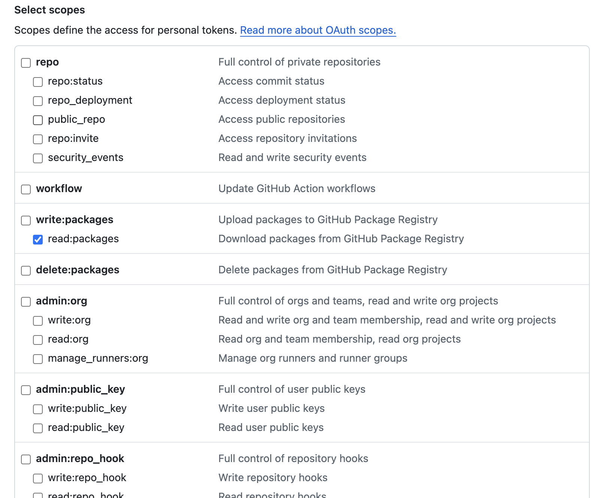
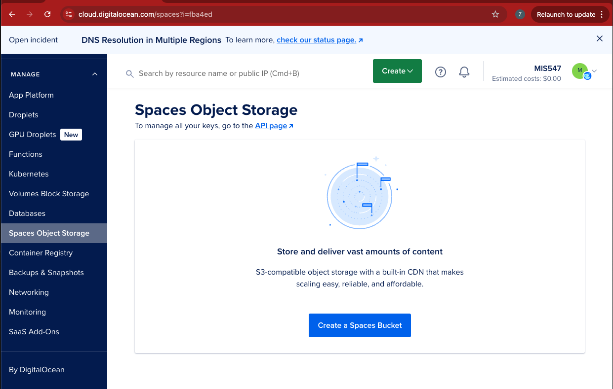

# Part 2: Add a Remote Model Artifact Store

MLflow tracking server’s key components are the tracking server UI, the backend store, and the artifacts store.

- The tracking server UI, as we’ve seen, provides a way for MLflow to track experiments, models, model metadata, environments, etc.
- The backend store is the database that accompanies the MLflow tracking server- this is where the runs, parameters, metrics, tags, and notes are stored.
- The artifact store is where the model’s artifacts are stored, including the files, models, images, etc.

 Note that there are several ways that we can configure MLflow, and it will depend on the requirements of the organization and project. These components can all be run on separate infrastructure. The options of where you can host your components are: 

- Tracking server: localhost or remote host
- Backend store: local filesystem or remote database
- Artifacts store: local filesystem or remote storage

For this assignment, we’ll run MLflow on a droplet, the backend store will be persisted on the droplet, and the artifacts store will be a spaces bucket. 

In order to set up our MLflow server using cloud infrastructure, we’ll need to modify our server settings:

1. Create a Spaces bucket to store our model’s artifacts
    - This allows for high availability; if the droplet running our Mlflow server crashes or is deleted, our registry will still have the models and metadata we need to avoid production issues where a model is not available for serving.
    - Having our backend store in a separate database can also be a good way to ensure high availability, and is an excellent choice when working with a high volume of models.
2. Persist our backend store as a database external to our MLflow tracking server infrastructure
3. Update our MLflow server host IP so that we can access it remotely. 
    1. We’ll also set up authentication so that we can securely access our MLflow server.

For ease of testing, we’ll experiment with the remote artifact store and the backend store before offloading MLflow tracking server to a droplet.

# Step 0: Create a GitHub Container Registry Personal Access Token

1. Login to GitHub. In the top-right hand corner, click on your profile icon and then choose **Settings**. On the far left-hand navigation, scroll down to <> **Developer Settings.**
2. On the left-hand navigation, select **Personal Access Token** and then **Token (classic)**
3. Create a token that you will use to login to the GitHub Container Registry via the CLI. 
4. You will need to scope your PAT access to allow  `read:packages` . See the screenshot below:



1. Name your token something descriptive (e.g., **GitHub Container Token**). 

# Step 1: Create an MLflow Container

1. First, we will login to GitHub Container Registry with our GitHub usernames and passwords. Run the shell commands below, replacing `YOUR_TOKEN` with the PAT we created in step 0, and `USERNAME` with your GitHub username. 

```bash
export CR_PAT=YOUR_TOKEN
echo $CR_PAT | docker login ghcr.io -u USERNAME --password-stdin
# Pull the latest version
docker pull ghcr.io/mlflow/mlflow
```

1. Next, we’ll run the container locally:

```bash
docker run -p 8000:5000 ghcr.io/mlflow/mlflow mlflow server -h 0.0.0.0
```

1. Navigate to 127.0.0.1:8000 in your browser, and you’ll see the tracking server running. 

# Step 2: Create a Spaces Bucket for our Artifact Store

Next, we’re going to create a spaces bucket to store our remote artifacts. This is a good practice, especially if you’re working on a distributed team. Having your model artifacts persisted in a centralized location, and isolated from ephemeral infrastructure where your web server is running, is always a good idea in cloud native deployments! 

1. Create a spaces bucket either by using the cloud console or the CLI.



You’ll need to give your spaces bucket a unique name. Use something similar to `mlflow-bucket-<your-name>` . You can add it to the Assignment-10 project.

1. Copy the origin endpoint for your bucket as you’ll need it when we launch our MLflow server.
2. Create an access key and a secret key so that we can programmatically write files to our bucket. In the control panel, click on API, and then choose the **Spaces Keys** tab. Give the key a unique name. Try something like `mlflow-spaces-bucket-<your name>` . 


1. Copy the secret key, as it will only be shown once. Also copy the Access key. Set these aside for now- we will use these when setting up our MLflow Tracking Server’s remote storage. 

In the directory that you created in Part 1, add a file called `.env` . This is a special kind of file that we can use for persisting environment variables. It can be used by Docker containers, and also by applications.

We want to set environment variables on our droplet so that MLflow runs can access the model registry (in this case, the Spaces bucket you created). 

<aside>

💡 As discussed in Unit 1, it is often the case that cloud object storage is designated as “S3-compatible”. In practice, this means that often unrelated and/or open source platforms and software expect S3 terminology and variable names:

- AWS_ACCESS_KEY_ID for access IDs
- AWS_SECRET_ACCESS_KEY for secrets
- prepend s3:// for the path to object storage when launching the mlflow server

Although we’re using DigitalOcean Spaces object storage as our registry backend, we will use the environment variable names `AWS_ACCESS_KEY_ID`  and `AWS_SECRET_ACCESS_KEY` for our environment variables and our bucket path will be prepended with `s3://` 

</aside>

**Set environment variables**

If your MLflow server is still running, stop it now by pressing `ctrl+c` . If you haven’t yet, create a file called `.env` in the same local directory that you created for part 1.

Now let’s add our environment variables to our .env file using VSCode, a text editor, or if you’re already working on a droplet, then by using `nano` .

Add the following lines to your `.env` file, replacing `<access_key>` and `<secret_key>` with your spaces bucket secret key and access key.

```bash
AWS_ACCESS_KEY_ID=<access_key>
AWS_SECRET_ACCESS_KEY=<secret_key>
```

Now, we’ll set our custom endpoint as an environment variable. While still in the nano editor, add the following to the end of the file, replacing `<region>.digitaloceanspaces.com` with your bucket’s origin endpoint starting at the region. For example, if your bucket origin endpoint is `https://mlflow-bucket-prof-z.sfo3.digitalocean.spaces.com`, your endpoint URL will be: `https://sfo3.digitaloceanspaces.com` 

```bash
MLFLOW_S3_ENDPOINT_URL=https://<region>.digitaloceanspaces.com
```

Save the file, or, if you’re using nano, press `CTRL+X` to exit nano. You’ll be prompted to save your file. Press `y` to save, then press enter to save to the current file. 

To check if your environment variables persisted, run:

```bash
echo $AWS_ACCESS_KEY_ID
echo $AWS_SECRET_ACCESS_KEY
echo $MLFLOW_S3_ENDPOINT_URL
```

Your access key, secret key, and MLFLOW_S3_ENDPOINT_URL should be returned. 

**Remote Artifacts Store**

**Use Tracking Server for proxied artifact access**

- To configure tracking server to connect to remote storage and serve artifacts, start the server with the `--artifacts-destination` flag. This should be the name of your bucket, prepended with `s3://`  . Replace `<spaces bucket name>` with the name you gave your spaces bucket, but leaving the `s3://`  part in place:

```bash
docker run -p 8000:5000 \
-e AWS_ACCESS_KEY_ID \
-e AWS_SECRET_ACCESS_KEY \
ghcr.io/mlflow/mlflow \
mlflow server \
-h 0.0.0.0 \
--default-artifact-root s3://**<spaces bucket name**> \
--serve-artifacts
```

Now, let’s test our MLflow server to make sure we can save our model artifacts in Spaces. 

Create a new Jupyter notebook in the same directory as your `.env` file, and add the following code:

```python
import os

import pandas as pd
from sklearn import datasets
from sklearn.linear_model import LogisticRegression
from sklearn.metrics import accuracy_score
from sklearn.model_selection import train_test_split

import boto3
import mlflow
from mlflow.models import infer_signature
```

```python
mlflow.set_tracking_uri("https://127.0.0.1:8000")
```

```python
mlflow.create_experiment(name="change_mlflow_artifact_registry")
mlflow.set_experiment("change_mlflow_artifact_registry")

```

```python
# Load the Iris dataset
X, y = datasets.load_iris(return_X_y=True)

# Split the data into training and test sets
X_train, X_test, y_train, y_test = train_test_split(X, y, test_size=0.2, random_state=42)

# Define the model hyperparameters
params = {"solver": "lbfgs", "max_iter": 1000, "multi_class": "auto", "random_state": 8888}

# Train the model
lr = LogisticRegression(**params)
lr.fit(X_train, y_train)

# Predict on the test set
y_pred = lr.predict(X_test)

# Calculate accuracy as a target loss metric
accuracy = accuracy_score(y_test, y_pred)
```

```python
# Start an MLflow run
with mlflow.start_run():
    # Log the hyperparameters
    mlflow.log_params(params)

    # Log the loss metric
    mlflow.log_metric("accuracy", accuracy)

    # Set a tag that we can use to remind ourselves what this run was for
    mlflow.set_tag("Training Info", "Basic LR model for iris data")

    # Infer the model signature
    signature = infer_signature(X_train, lr.predict(X_train))

    # Log the model
    model_info = mlflow.sklearn.log_model(
        sk_model=lr,
        artifact_path="iris-model",
        signature=signature,
        input_example=X_train,
        registered_model_name="basic_lr_iris_model",
    )
```

Evaluate each of the cells above in your notebook. Then, open your browser to `127.0.0.1:8000` and you should see the new experiment listed. When you click into **models**, you should also see the `basic_lr_iris_model` registered. 

Make sure that you can access the model for use at inference time by adding the following code:

```python
loaded_model = mlflow.pyfunc.load_model(model_info.model_uri)

predictions = loaded_model.predict(X_test)

iris_feature_names = datasets.load_iris().feature_names

# Convert X_test validation feature data to a Pandas DataFrame
result = pd.DataFrame(X_test, columns=iris_feature_names)

# Add the actual classes to the DataFrame
result["actual_class"] = y_test

# Add the model predictions to the DataFrame
result["predicted_class"] = predictions

result[:4]
```

Now, navigate to your Spaces bucket, and investigate how the model and the model’s artifacts were saved. Note the different environment configuration files that are present! 